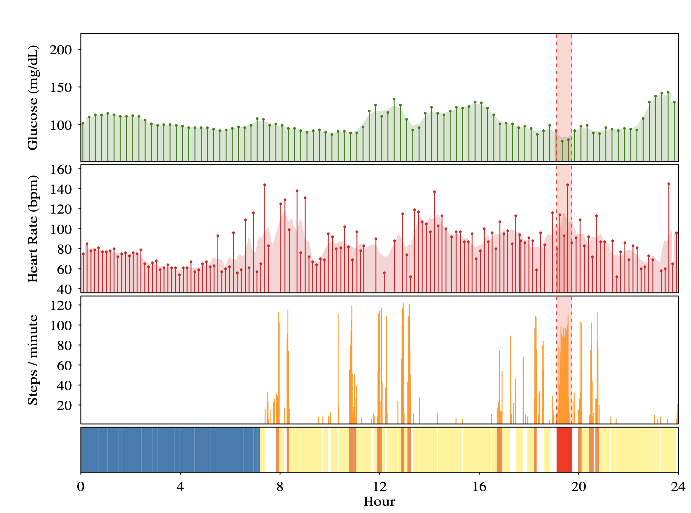

```{r, setup, echo=FALSE, warning = FALSE, message = FALSE, results = 'hide'}
library(kableExtra)
library(BoutrosLab.plotting.general)
library(forecast)

set.seed(13)

knitr::opts_chunk$set(echo = FALSE, warning = FALSE, message = FALSE, fig.align = 'center', out.width = '90%', fig.pos = 'H');

# CB Palette like ESL
cbPalette <- c(
  "#999999", "#E69F00", "#56B4E9", "#009E73",
  "#F0E442", "#0072B2", "#D55E00", "#CC79A7")
```

## Overview
  1. Time series definitions
  2. ARMA
  3. Linear model approach
  4. Alternative error models
  5. Solutions

## Time series
  - A time series is a set of observations $x_t$, each recorded at a specific time $t$.
  - Can be discrete or continuous
  - $x_1, x_2, x_3, \ldots, x_n$
  
## Example from ExOnc

  
## Time series definitions
  - Lag is a previous value in the time series
    - Lag 1 is previous value
    - Lag 2 for $x_{t}$ is $x_{t - 2}$
  - Autocorrelation/autocovariance function (`acf` function in R)
    - Computes the correlation for each lag in the time series
    - ACF at 0 is always 1
    - ACF at 1 is the correlation between $x_t$ and $x_{t-1}$ for all values in the time series
  - Partial autocorrelation function (`pacf` function in R)

$$
\dfrac{\text{Covariance}(x_t, x_{t-2}| x_{t-1})}{\sqrt{\text{Variance}(x_t|x_{t-1})\text{Variance}(x_{t-2}|x_{t-1})}}
$$

## Time series definitions
  - **Differencing** a time series $\{x_t\}$ results in a new time series $\{x^{\prime}_t\}$ where $x^{\prime}_t = x_t - x_{t - 1}$
  - **Seasonality** is a repeating pattern that occurs on a period
  - A time series is **stationary** if the ACF does not depend on time $t$, but only on the lag $h$.
  
## Differencing

```{r}
n <- 80
y <- ts(3 * sort(rnorm(n)) + arima.sim(n, model = list(ar = c(.1))))
par(mfrow = c(1, 2))
plot(y)
plot(diff(y))
```

## Seasonality

```{r}
par(mfrow = c(1, 2))
y <- ts(rnorm(80,0,3) + 20*sin(2*pi*(1:80)/12), frequency=12)
plot(y)
plot(diff(y))
```
    
## Example - Normal
  - $\{ X_t \}, X_t \sim N(0,1)$
  - This is an iid sample so is no dependency between any of the points
  
```{r}
x <- ts(rnorm(100))
plot(x)
```

## Example - Normal
```{r}
par(mfrow = c(1, 2))
acf(x)
pacf(x)
```

## Autoregressive model - AR(1)
  - $X_t = \phi X_{t - 1} + Z_t$, $t = 0, 1, \ldots$ where $Z_t$ is white noise, mean 0 sd $\sigma$, $|\phi| < 1$
  
$$
\begin{aligned}
  X_1 &= Z_1 \\
  X_2 &= \phi Z_1 + Z_2\\
  X_3 &= \phi (\phi Z_1 + Z_2) + Z_3\\
  &= \phi^2 Z_1 + \phi Z_2 + Z_3 \\
  X_t &= Z_t + \phi Z_{t - 1} + \phi^2 Z_{t - 2} + \cdots + \phi^{t - 1} Z_1
\end{aligned}
$$
  
## Example - AR(1)
```{r}
n <- 1000
x.ar1 <- arima.sim(n, model = list(ar = c(.1)))
x.ar2 <- arima.sim(n, model = list(ar = c(.9)))
x.ar3 <- arima.sim(n, model = list(ar = c(-.9)))

par(mfrow = c(3, 1))
plot(x.ar1, ylim = c(min(x.ar1, x.ar2, x.ar3), max(x.ar1, x.ar2, x.ar3)), ylab = '', main = "phi = 0.1")
plot(x.ar2, ylim = c(min(x.ar1, x.ar2, x.ar3), max(x.ar1, x.ar2, x.ar3)), ylab = '', col = cbPalette[2], main = "phi = 0.9")
plot(x.ar3, ylim = c(min(x.ar1, x.ar2, x.ar3), max(x.ar1, x.ar2, x.ar3)), ylab = '', col = cbPalette[3], main = "phi = -0.9")
```

## Autoregressive AR(1) - ACF/PACF
  - In general, AR(p) should have **PACF** decreasing for $p$ lags then have 0 partial autocorrelation
  - AR(p) should have **ACF** gradually decreasing to 0
```{r}
par(mfrow = c(1, 2))
acf(x.ar2)
pacf(x.ar2)
```

## Examples - Random walk
If we let $\phi = 1$, then time series diverges and it is now a random walk
```{r}
x <- rnorm(100)
y <- rnorm(100)
z <- rnorm(100)
x.rw <- ts(cumsum(x))
y.rw <- ts(cumsum(y))
z.rw <- ts(cumsum(z))
plot(x.rw, ylim = c(min(x.rw,y.rw,z.rw), max(x.rw,y.rw,z.rw)), ylab = '')
lines(y.rw, col = cbPalette[2])
lines(z.rw, col = cbPalette[3])
```

## Moving average - MA(1)
  - MA(1): $X_t = Z_t + \theta Z_{t - 1}$, $t = 0, 1, \ldots$ where $Z_t$ is white noise, mean 0 sd $\sigma$
  
$$
\begin{aligned}
  X_1 &= Z_1 \\
  X_2 &= Z_2 + \theta Z_1 \\
  X_3 &= Z_3 + \theta Z_2
\end{aligned}
$$

## Moving average - MA(3)
  - MA(3): $X_t = Z_t + \theta_1 Z_{t - 1} + \theta_2 Z_{t - 2} + \theta_3 Z_{t - 3}$, $t = 0, 1, \ldots$ where $Z_t$ is white noise, mean 0 sd $\sigma$
$$
\begin{aligned}
  X_1 &= Z_1 \\
  X_2 &= Z_2 + \theta_1 Z_1 \\
  X_3 &= Z_3 + \theta_1 Z_2 + \theta_2 Z_{1} \\
  X_4 &= Z_4 + \theta_1 Z_{3} + \theta_2 Z_{2} + \theta_3 Z_{1}\\
  X_5 &= Z_5 + \theta_1 Z_{4} + \theta_2 Z_{3} + \theta_3 Z_{2}
\end{aligned}
$$

## Moving average MA(q)
```{r}
n <- 1000
x.ma.q1 <- arima.sim(n, model = list(ma = c(1)))
x.ma.q2 <- arima.sim(n, model = list(ma = c(1, 1, 1)))
x.ma.q3 <- arima.sim(n, model = list(ma = c(1, 1, 1, 1, 1)))

par(mfrow = c(3, 1))
plot(x.ma.q1, ylim = c(min(x.ma.q1, x.ma.q2, x.ma.q3), max(x.ma.q1, x.ma.q2, x.ma.q3)), ylab = '', main = "MA(1)")
plot(x.ma.q2, ylim = c(min(x.ma.q1, x.ma.q2, x.ma.q3), max(x.ma.q1, x.ma.q2, x.ma.q3)), ylab = '', col = cbPalette[2], main = "MA(3)")
plot(x.ma.q3, ylim = c(min(x.ma.q1, x.ma.q2, x.ma.q3), max(x.ma.q1, x.ma.q2, x.ma.q3)), ylab = '', col = cbPalette[3], main = "MA(5)")
```

## Moving average MA(q) - ACF/PACF
  - In general, MA(q) should have ACF decreasing to $q$ lags then have 0 autocorrelation
  - MA(q) should have PACF gradually decreasing to 0
```{r}
par(mfrow = c(1, 2))
acf(x.ma.q3, main = 'MA(5)')
pacf(x.ma.q3, main = 'MA(5)')
```

## Simple Linear Regression

For a pair of $(x_i, y_i)$, 
$$
y_i = \beta x_i + \alpha + \epsilon_i
$$

- $\varepsilon_i \sim N(0, \sigma^2)$
- $\{\varepsilon_i\}$ are **uncorrelated**
- variance is **constant**

## Simple Linear Regression - Time series
  - If we have time series data $(t_i, y_i)$, the easiest way to model this would be to perform a linear regression of $y$ on $t$
    - Does this work with the assumptions? (Uncorrelated, constant variance)
  - We can check the residuals (difference between predicted value and observed value)
  
## Simple Linear Regression - Time series
True model is $y_i = 3t_i + \varepsilon_i$, where $\{ \varepsilon_i \}$ is AR(1).
```{r}
set.seed(13)
x <- sort(rnorm(100))
x.ar <- as.numeric(arima.sim(100, model = list(ar = c(.25))))
y <- 3 * x + x.ar
plot(y ~ x)
```

## Simple Linear Regression - AR(1) Example

  - First we can do the naive analysis with a linear model
  - $\hat{\beta}$ (estimate for $\beta$) is still unbiased, even ignoring the error structure
  - Standard errors are incorrect if we have misspecified the error structure
  
```{r, echo = TRUE}
mod <- lm(y ~ x)
summary(mod)$coefficients
```

## Simple Linear Regression - AR(1) Example

```{r, echo = TRUE}
par(mfrow = c(1, 2))
acf(residuals(mod))
pacf(residuals(mod))
```

## Simulations
  - Simulate the following:
    - Linear regression when $y_i = 3t_i + \varepsilon_i$, where $\{ \varepsilon_i \}$ is AR(1) with $\phi = 0.75$
    - Linear regression with standard normal errors
    
```{r, cache=TRUE}
set.seed(13)
res1 <- t(replicate(1e4, {
  x <- sort(rnorm(100))
  x.ar <- as.numeric(arima.sim(100, model = list(ar = c(.75))))
  y <- 3 * x + x.ar
  summary(lm(y ~ x))$coefficients[2, ]
}))

res.correct <- t(replicate(1e4, {
  x <- sort(rnorm(100))
  y <- 3 * x + rnorm(100)
  summary(lm(y ~ x))$coefficients[2, ]
}))
```

  - $\text{Var}(\hat{\beta})$ is `r round(var(res1[, 1]) / var(res.correct[,1]), 2)` times higher with the AR(1) errors than the variance in the correct model
  - Note that the variance is not always higher, but could be biased in either direction
  - In this case our standard errors will be higher on average and p-values higher as well

## Solutions
  - Use a model that does not imply constant, non-correlated errors
    - `forecast::auto.arima` can fit linear regression with ARIMA errors
      - Coefficients can be added via `xreg` argument
    - `nlme::gls` generalized least squares fitting (Errors allowed to be correlated or unequal variance)
      - Correlation structure added via `correlation = corAR1(form = ~ 1 | group)`
    - `nlme::lme` linear mixed modeling (e.g. fixed and random effects)
      - Note that correlation structure modeling of the errors is not supported in `lme4`
  - `mgcv` package: Generalized additive (mixed) models with support for correlation structure (Thanks Jaron for suggestion)

## auto.arima and gls

```{r, echo=TRUE, eval=FALSE}
nlme::gls(y ~ x, correlation = nlme::corAR1(form = ~ 1))
forecast::auto.arima(y, xreg = x, d = 0)
```

## 

Questions?
