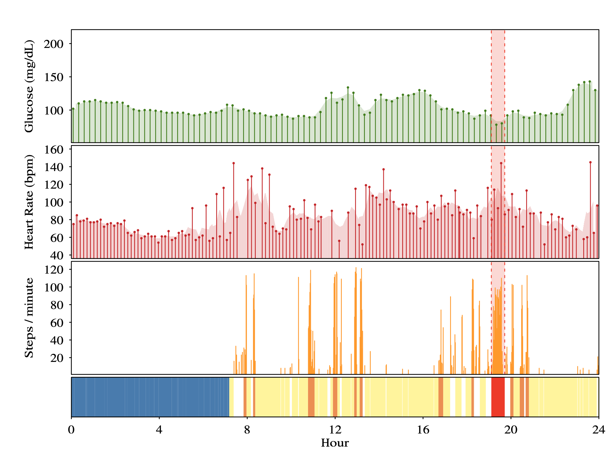
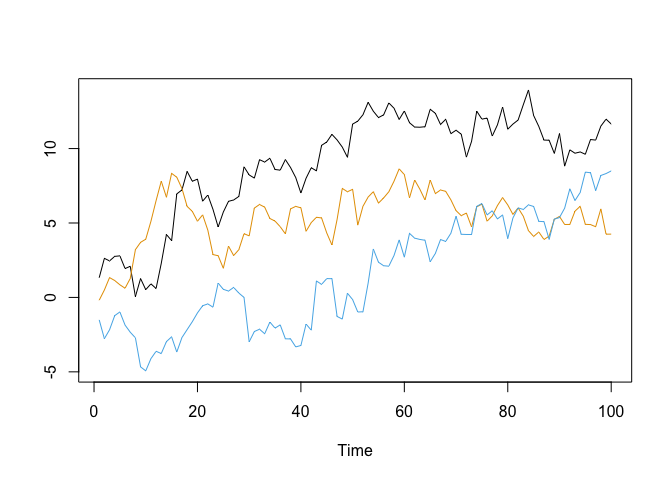

Time-series analysis
================
Stefan Eng
5/12/2021

## Overview

1.  Time series definitions
2.  ARMA
3.  Linear model approach
4.  Alternative error models
5.  Solutions

## Time series

-   A time series is a set of observations *x*<sub>*t*</sub>, each
    recorded at a specific time *t*.
-   Can be discrete or continuous
-   *x*<sub>1</sub>, *x*<sub>2</sub>, *x*<sub>3</sub>, …, *x*<sub>*n*</sub>

## Example from ExOnc



## Time series definitions

-   Lag is a previous value in the time series
    -   Lag 1 is previous value
    -   Lag 2 for *x*<sub>*t*</sub> is *x*<sub>*t* − 2</sub>
-   Autocorrelation/autocovariance function (`acf` function in R)
    -   Computes the correlation for each lag in the time series
    -   ACF at 0 is always 1
    -   ACF at 1 is the correlation between *x*<sub>*t*</sub> and
        *x*<sub>*t* − 1</sub> for all values in the time series
-   Partial autocorrelation function (`pacf` function in R)

$$
\\dfrac{\\text{Covariance}(x\_t, x\_{t-2}\| x\_{t-1})}{\\sqrt{\\text{Variance}(x\_t\|x\_{t-1})\\text{Variance}(x\_{t-2}\|x\_{t-1})}}
$$

## Time series definitions

-   **Differencing** a time series {*x*<sub>*t*</sub>} results in a new
    time series {*x*<sub>*t*</sub><sup>′</sup>} where
    *x*<sub>*t*</sub><sup>′</sup> = *x*<sub>*t*</sub> − *x*<sub>*t* − 1</sub>
-   **Seasonality** is a repeating pattern that occurs on a period
-   A time series is **stationary** if the ACF does not depend on time
    *t*, but only on the lag *h*.

## Differencing


## Seasonality


## Example - Normal

-   {*X*<sub>*t*</sub>}, *X*<sub>*t*</sub> ∼ *N*(0, 1)
-   This is an iid sample so is no dependency between any of the points


## Example - Normal


## Autoregressive model - AR(1)

-   *X*<sub>*t*</sub> = *ϕ**X*<sub>*t* − 1</sub> + *Z*<sub>*t*</sub>,
    *t* = 0, 1, … where *Z*<sub>*t*</sub> is white noise, mean 0 sd *σ*,
    \|*ϕ*\| &lt; 1

$$
\\begin{aligned}
  X\_1 &= Z\_1 \\\\
  X\_2 &= \\phi Z\_1 + Z\_2\\\\
  X\_3 &= \\phi (\\phi Z\_1 + Z\_2) + Z\_3\\\\
  &= \\phi^2 Z\_1 + \\phi Z\_2 + Z\_3 \\\\
  X\_t &= Z\_t + \\phi Z\_{t - 1} + \\phi^2 Z\_{t - 2} + \\cdots + \\phi^{t - 1} Z\_1
\\end{aligned}
$$

## Example - AR(1)


## Autoregressive AR(1) - ACF/PACF

-   In general, AR(p) should have **PACF** decreasing for *p* lags then
    have 0 partial autocorrelation
-   AR(p) should have **ACF** gradually decreasing to 0
    

## Examples - Random walk

If we let *ϕ* = 1, then time series diverges and it is now a random walk


## Moving average - MA(1)

-   MA(1):
    *X*<sub>*t*</sub> = *Z*<sub>*t*</sub> + *θ**Z*<sub>*t* − 1</sub>,
    *t* = 0, 1, … where *Z*<sub>*t*</sub> is white noise, mean 0 sd *σ*

$$
\\begin{aligned}
  X\_1 &= Z\_1 \\\\
  X\_2 &= Z\_2 + \\theta Z\_1 \\\\
  X\_3 &= Z\_3 + \\theta Z\_2
\\end{aligned}
$$

## Moving average - MA(3)

-   MA(3):
    *X*<sub>*t*</sub> = *Z*<sub>*t*</sub> + *θ*<sub>1</sub>*Z*<sub>*t* − 1</sub> + *θ*<sub>2</sub>*Z*<sub>*t* − 2</sub> + *θ*<sub>3</sub>*Z*<sub>*t* − 3</sub>,
    *t* = 0, 1, … where *Z*<sub>*t*</sub> is white noise, mean 0 sd *σ*
    $$
    \\begin{aligned}
      X\_1 &= Z\_1 \\\\
      X\_2 &= Z\_2 + \\theta\_1 Z\_1 \\\\
      X\_3 &= Z\_3 + \\theta\_1 Z\_2 + \\theta\_2 Z\_{1} \\\\
      X\_4 &= Z\_4 + \\theta\_1 Z\_{3} + \\theta\_2 Z\_{2} + \\theta\_3 Z\_{1}\\\\
      X\_5 &= Z\_5 + \\theta\_1 Z\_{4} + \\theta\_2 Z\_{3} + \\theta\_3 Z\_{2}
    \\end{aligned}
    $$

## Moving average MA(q)


## Moving average MA(q) - ACF/PACF

-   In general, MA(q) should have ACF decreasing to *q* lags then have 0
    autocorrelation
-   MA(q) should have PACF gradually decreasing to 0
    

## Simple Linear Regression

For a pair of (*x*<sub>*i*</sub>, *y*<sub>*i*</sub>),
*y*<sub>*i*</sub> = *β**x*<sub>*i*</sub> + *α* + *ϵ*<sub>*i*</sub>

-   *ε*<sub>*i*</sub> ∼ *N*(0, *σ*<sup>2</sup>)
-   {*ε*<sub>*i*</sub>} are **uncorrelated**
-   variance is **constant**

## Simple Linear Regression - Time series

-   If we have time series data (*t*<sub>*i*</sub>, *y*<sub>*i*</sub>),
    the easiest way to model this would be to perform a linear
    regression of *y* on *t*
    -   Does this work with the assumptions? (Uncorrelated, constant
        variance)
-   We can check the residuals (difference between predicted value and
    observed value)

## Simple Linear Regression - Time series

True model is
*y*<sub>*i*</sub> = 3*t*<sub>*i*</sub> + *ε*<sub>*i*</sub>, where
{*ε*<sub>*i*</sub>} is AR(1).


## Simple Linear Regression - AR(1) Example

-   First we can do the naive analysis with a linear model
-   *β̂* (estimate for *β*) is still unbiased, even ignoring the error
    structure
-   Standard errors are incorrect if we have misspecified the error
    structure

``` r
mod <- lm(y ~ x)
summary(mod)$coefficients
```

    ##              Estimate Std. Error   t value     Pr(>|t|)
    ## (Intercept) 0.1148917  0.1141530  1.006471 3.166676e-01
    ## x           3.0840179  0.1204029 25.614140 3.245706e-45

## Simple Linear Regression - AR(1) Example

``` r
par(mfrow = c(1, 2))
acf(residuals(mod))
pacf(residuals(mod))
```


## Simulations

-   Simulate the following:
    -   Linear regression when
        *y*<sub>*i*</sub> = 3*t*<sub>*i*</sub> + *ε*<sub>*i*</sub>,
        where {*ε*<sub>*i*</sub>} is AR(1) with *ϕ* = 0.75
    -   Linear regression with standard normal errors
-   Var(*β̂*) is 13.68 times higher with the AR(1) errors than the
    variance in the correct model
-   Note that the variance is not always higher, but could be biased in
    either direction
-   In this case our standard errors will be higher on average and
    p-values higher as well

## Solutions

-   Use a model that does not imply constant, non-correlated errors
    -   `forecast::auto.arima` can fit linear regression with ARIMA
        errors
        -   Coefficients can be added via `xreg` argument
    -   `nlme::gls` generalized least squares fitting (Errors allowed to
        be correlated or unequal variance)
        -   Correlation structure added via
            `correlation = corAR1(form = ~ 1 | group)`
    -   `nlme::lme` linear mixed modeling (e.g. fixed and random
        effects)
        -   Note that correlation structure modeling of the errors is
            not supported in `lme4`
-   `mgcv` package: Generalized additive (mixed) models with support for
    correlation structure (Thanks Jaron for suggestion)

## auto.arima and gls

``` r
nlme::gls(y ~ x, correlation = nlme::corAR1(form = ~ 1))
forecast::auto.arima(y, xreg = x, d = 0)
```

## 

Questions?
